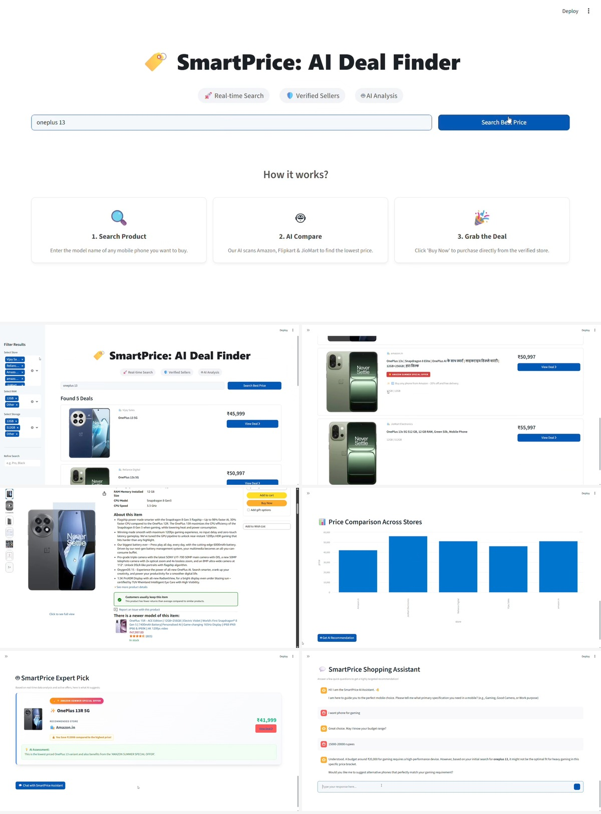

# Smart AI Price Deal Finder 🏷️

An AI-powered mobile price comparison tool that aggregates real-time data from platforms like Amazon, Flipkart, and JioMart, leveraging Gemini AI to recommend the absolute best deals.

## Project Preview
 
*(Note: Replace this with your actual screenshot image)*

## Tech Stack
* **Frontend:** Streamlit
* **Backend:** FastAPI, Python
* **AI Integration:** Google Gemini 2.5 Flash API
* **Search Engine:** SERP API

## Key Features
* 🚀 **Real-time Search:** Fetches live shopping data based on user queries.
* 🛡️ **Smart Filtering:** Automatically removes irrelevant accessories like cases, covers, and chargers to show only mobile phones.
* 🤖 **AI Analysis:** Uses Gemini to identify special sale badges (like Jio Mega Sale) and determine the highest-value deal.
* 📊 **Price Comparison Graph:** Visualizes price differences across multiple verified stores for better decision making.
* 💬 **Smart Assistant:** Interactive chatbot to help users find phones based on specific needs like gaming or camera.
